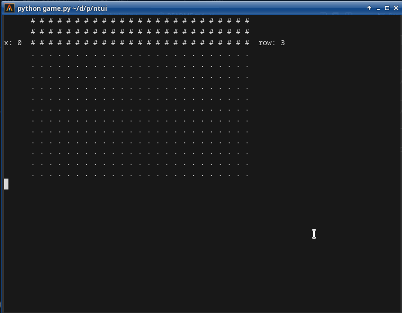
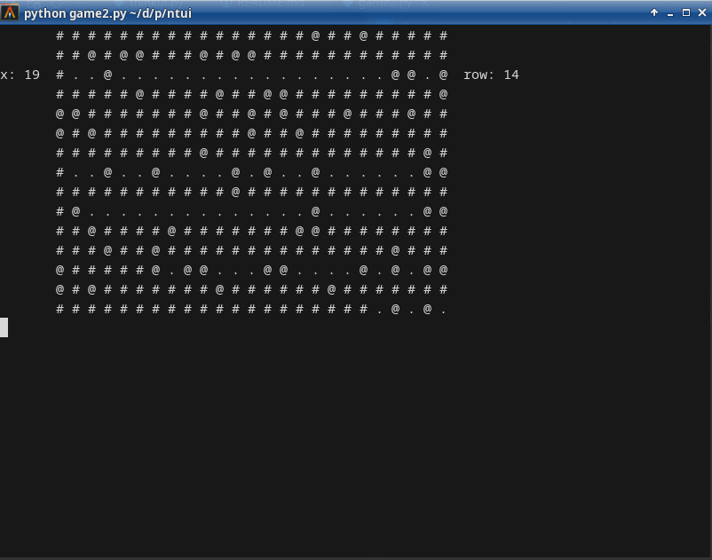
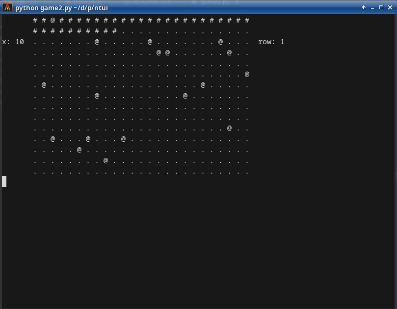
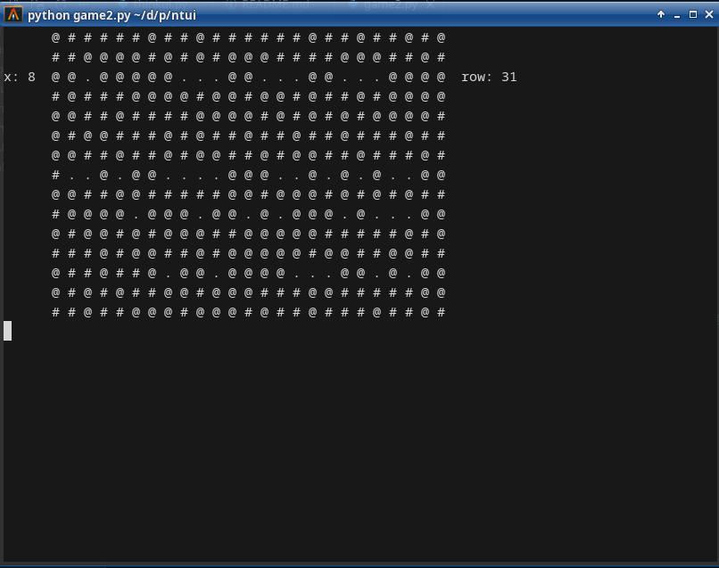

[Русский README](README.RU.md)

- **By**: [Neori](https://neoriakm.github.io/neoriakm)
- **README of** [NeUI](https://github.com/neoriakm/neui)

# NeUI - graphics in console

### The easiest framework for making interface in console

I made very simple TUI framework for making a games. If you need it - move file `ntui.py` to your project, and import it, like
```python
import neui
# imports

run = True
while run:
    # and your code
    # ...
```


**Has no requirements**. Only `Python 3.4+`. **Using modules** - `os, time`

**Code examples** - [game.py](1) , [game2.py](2) , [game3.py](3)

**Documentation** - [documentation.md](txt/documentation.md)

## images






